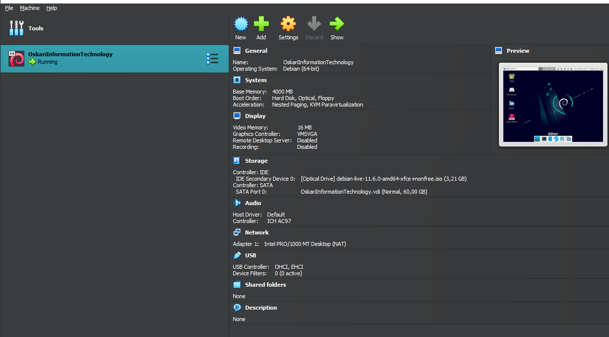
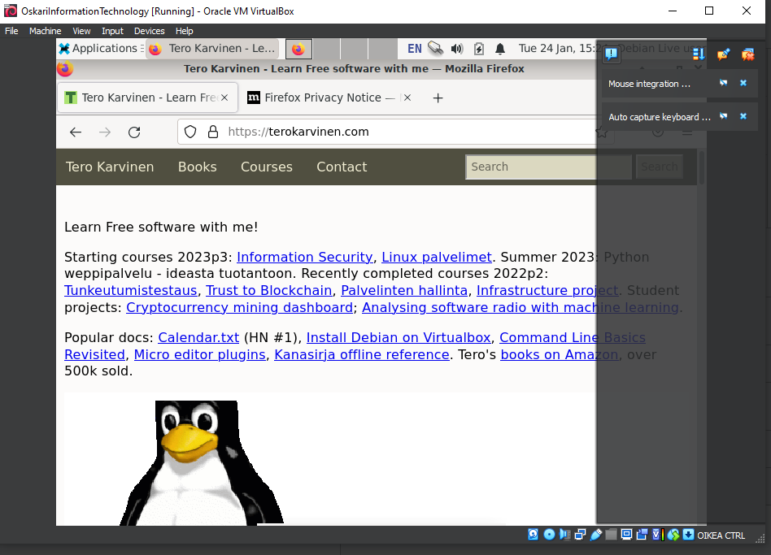
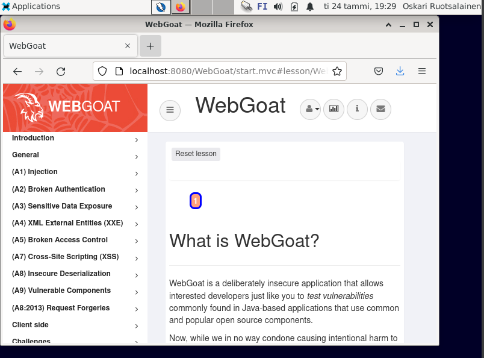

<h1>H1 by Oskari Ruotsalainen</h1>
The emergence of ATPs forced organizations to re-evaluate their current technologies and processes, as they were not sufficient in mitigating the risks. A kill chain is a systematic process to target and engage an adversary to create desired effects. This sort of modeling is commonly utilized in both military and information security contexts. A kill chain model concerning intrusions according to the material is as follows:
1.	Reconnaissance - Information is gathered to determine a target/targets. 
2.	Weaponization – Malware is chosen/created/modified to be used in the attack.
3.	Delivery – Malware is used to infiltrate.
4.	Exploitation – Infiltration is taken further to reach the end target(s).
5.	Installation – Malware is installed to take control and exfiltrate data.
6.	Command and Control (C2) – The malware is communicated with and controlled.
7.	Actions on Objectives – Malware is utilized to carry out the objectives.
The intrusion kill chain becomes a model for greater studying and understanding of the aggressor when used correctly. This aids in making better security decisions and measurements against possible attacks.  Defending against different intrusion kill chain phases can be divided in to the following actions: detect, deny, disrupt, degrade, deceive, and destroy.

<h2>Source</h2>
Hutchins et al 2011: Intelligence-Driven Computer Network Defense Informed by Analysis of Adversary Campaigns and Intrusion Kill Chains
 
 
<h2>A summary of Karvinen 2020: Command Line Basics Revisited</h2>
Quick summary of some of the main commands:
pwd - prints the working directory
ls – lists files in working directory
cd – used to change directory
less – shows following file in less space
nano – opens nano text editor
mkdir – makes new directory
mv – moves or renames directory
cp – used to copy
rmdir – used to remove a directory
rm – used to remove a file
ssh - opens a remote command shell
exit – exit back to own machine
scp – securely copy a folder to a folder
man – opens manual page
… and so on
 
a)

<h3>to level 0</h3>
ssh bandit0@bandit.labs .overthewire.org -p 2220

<h3>Level 0</h3>
password: NH2SXQwcBdpmTEzi3bvBHMM9H66vVXjL
cat readme to get the password

<h3>Level 1</h3>
next password: NH2SXQwcBdpmTEzi3bvBHMM9H66vVXjL
cat < - to get the password

<h3>level 2</h3> 
next password: rRGizSaX8Mk1RTb1CNQoXTcYZWU6lgzi
cat spaces\ in\ this\ filename to get password

<h3>level 3</h3>
next password: 2EW7BBsr6aMMoJ2HjW067dm8EgX26xNe
cd inhere to go to directory
ls -al to show the hidden files
cat < .hidden .hidden to get the key

<h3>level 4</h3>
next password: lrIWWI6bB37kxfiCQZqUdOIYfr6eEeqR
This one was hard. Eventually found the password at ./-file07
cat < ./-file07

b) Virtual box and vm are installed and is working according to the course material:

c) WebGoat is installed and is working according to the material given: 

e) I tried for ages to get the ZAP thing to work. Did not manage...

