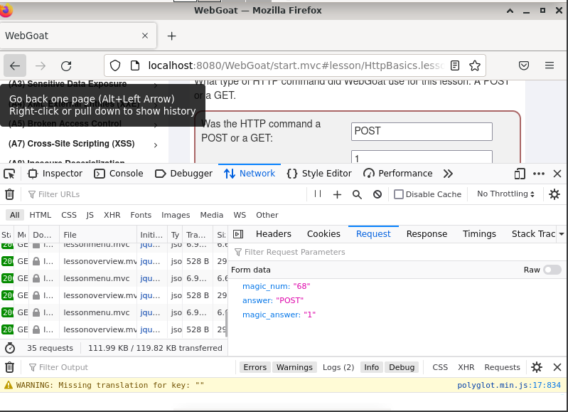

<h1>H1 First steps by Oskari Ruotsalainen</h1>
<h3>x)Summary of the Hutchins et al 2011: Intelligence-Driven Computer Network Defense Informed by Analysis of Adversary Campaigns and Intrusion Kill Chains, chapters Abstract, 3.2 Intrusion Kill Chain and 3.3 Courses of Action</h3>

The introduction of ATPs compelled enterprises to reconsider their current technology and processes, which were insufficient in mitigating risks. A kill chain is a systematic process for targeting and engaging an adversary in order to achieve the intended results. This type of modeling is widely used in military and information security contexts. According to the material, a kill chain model for intrusions is as follows:

1. Reconnaissance - Information is gathered to determine a target/targets. 
2. Weaponization – Malware is chosen/created/modified to be used in the attack.
3. Delivery – Malware is used to infiltrate.
4. Exploitation – Infiltration is taken further to reach the end target(s).
5. Installation – Malware is installed to take control and exfiltrate data.
6. Command and Control (C2) – The malware is communicated with and controlled.
7. Actions on Objectives – Malware is utilized to carry out the objectives.
<br>
The intrusion kill chain becomes a model for greater studying and understanding of the aggressor when used correctly. This aids in making better security decisions and measurements against possible attacks.  Defending against different intrusion kill chain phases can be divided in to the following actions: detect, deny, disrupt, degrade, deceive, and destroy.

<h2>Source</h2>
Hutchins et al 2011: Intelligence-Driven Computer Network Defense Informed by Analysis of Adversary Campaigns and Intrusion Kill Chains
<br>
<br>
<h2>A summary of Karvinen 2020: Command Line Basics Revisited</h2>
Quick summary of some of the main commands:

```
pwd - prints the working directory
ls – lists files in working directory
cd – used to change directory
less – shows following file in less space
nano – opens nano text editor
mkdir – makes new directory
mv – moves or renames directory
cp – used to copy
rmdir – used to remove a directory
rm – used to remove a file
ssh - opens a remote command shell
exit – exit back to own machine
scp – securely copy a folder to a folder
man – opens manual page
```

… and so on
<h2>Source</h2>
https://terokarvinen.com/2020/command-line-basics-revisited/
<br>

<h3>a) Bandit oh-five. Solve Over The Wire: Bandit the first five levels (0-4)</h3>

<h3>level 0</h3>

Used command: `ssh bandit0@bandit.labs .overthewire.org -p 2220` and used password bandit0

Inputted `ls` to show files and `cat readme` to get password: `NH2SXQwcBdpmTEzi3bvBHMM9H66vVXjL`

<h3>Level 1</h3>

Used command: `ssh bandit1@bandit.labs .overthewire.org -p 2220` and level 0 password to get in.

`ls` again to list files and `cat < -` to get the password: `NH2SXQwcBdpmTEzi3bvBHMM9H66vVXjL`


<h3>level 2</h3> 

Used command: `ssh bandit2@bandit.labs .overthewire.org -p 2220` and level 1 password to get in.

`ls` again to list files and command `cat spaces\ in\ this\ filename` to get password: `rRGizSaX8Mk1RTb1CNQoXTcYZWU6lgzi`

<h3>level 3</h3>

Used command: `ssh bandit3@bandit.labs .overthewire.org -p 2220` and level 2 password to get in.

`ls` again to list files and command `cd inhere` to go to inhere directory. Used `ls -al`  to show the hidden files and `cat < .hidden .hidden ` to get next password: `2EW7BBsr6aMMoJ2HjW067dm8EgX26xNe`


<h3>level 4</h3>'

Used command: `ssh bandit4@bandit.labs .overthewire.org -p 2220` and level 3 password to get in.

`ls` again and `cd inhere` to go to directory and commands `ls -al` and `find . -type f | xargs file` to find human readable files. Only one file in ASCII format and I got the password: `lrIWWI6bB37kxfiCQZqUdOIYfr6eEeqR` inside that by inputting `cat ./-file07`


<h3>b) Bullseye. Install Debian 11-Bullseye virtual machine in VirtualBox</h3>
this part is written from memory

1. Downloaded the Debian ISO image following the link from the course material: https://terokarvinen.com/2021/install-debian-on-virtualbox/
2. Installed Virtual Box from https://www.virtualbox.org/wiki/Downloads
3. Created the new virtual machine according to the instructions and this is what the specs look like:

```
Name: OskariInformationTechnology
Type: Linux
Version: Debian (64-bit)
Memory Size: 4000 MB
Virtual Hard Disk: 60GB
```


I the booted up the VM and tested that everything is working by searching https://terokarvinen.com/


I ran the installer as was described in the instructions. And I checked that the login is working properly.

For updates I ran the command: `sudo apt-get update` and upgraded everything with: `sudo apt-get -y dist-upgrade`

Lastly I installed and enabled a firewall with commands:

```
sudo apt-get -y install ufw
sudo ufw enable
```

<h3>c) WebGoat. Install WebGoat practice target</h3>
written from memory

Inputted command `$ sudo apt-get -y install openjdk-11-jre ufw wget bash-completion` to install Java

then commands: `wget https://terokarvinen.com/2020/install-webgoat-web-pentest-practice-target/webgoat-server-8.0.0.M26.jar` and `java -jar webgoat-server-8.0.0.M26.jar` install and run WebGoat. I registered and heres a proof of it working:


<h3>d) Hacker warmup. Solve these tasks on WebGoat</h3>

<h4>General:HTTP Basics</h4>

I got the magic number from trying to input the wrong answer and checking request from "attack2" from the page inspection:



<h4>General:Developer tools</h4>

I was able to call the function by using the Developer tools on Google Chrome and find the networkNum from the network tab, but unfortunately forgot to take screens shots!

<h5>Thank you for reading!</h5>

